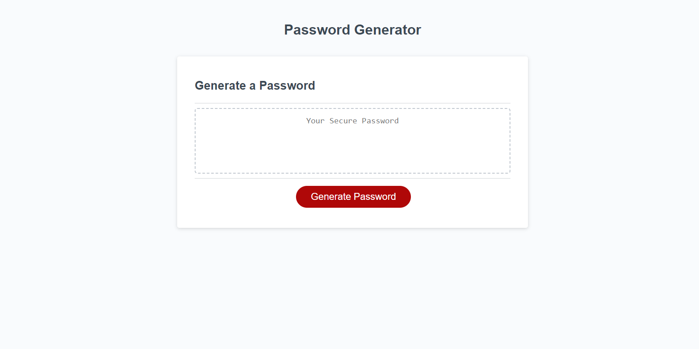
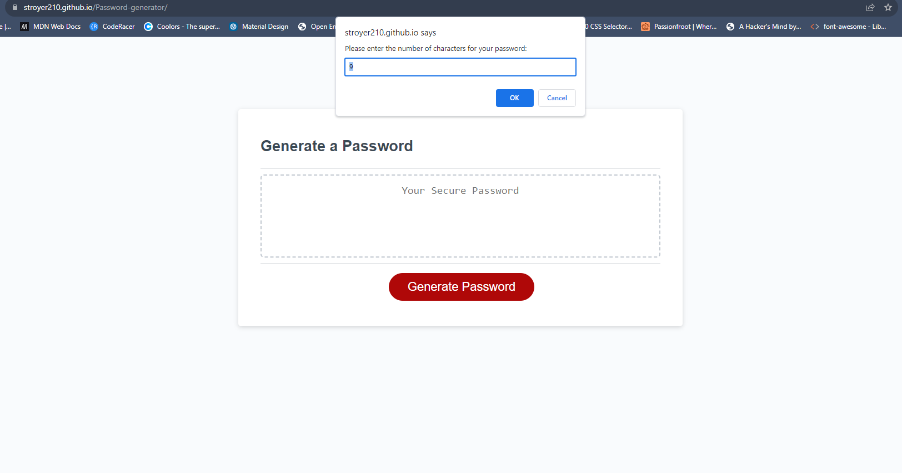
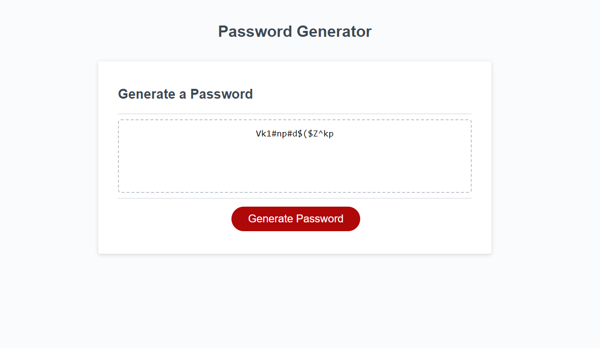

# Password Generator
  

## Description  :bookmark_tabs:

This project was really good because it made me use a lot of JavaScript code that is really useful for any kind of project; code such "Functions", "for loop", etcetera. I knew it was a really important project so I spent a lot of time trying to understand what kinda of code to use and type until I finally found it, it really made me think but after I created a pseudo code, it was so much easier. 
The functionality of the application is to create a random password according to the items that we want; like uppercase, numbers, and whatnot. Finally, one of the things I learned was to actually create a pseudo code and work through it; after that the code doesn't seem that difficult.

## Installation :computer:

You are able to see the password generator in two different ways, depending on what you are looking for:

 1. If you only want to try the actual application, you can go to this URL: https://stroyer210.github.io/Password-generator/
 2. If you want to see my code, you have my repository's folder on top, plus all the documents, such HTML, CSS and JavaScript.

## Usage :bar_chart:
If you are unable to open the URL, I attached a screenshot of it below:
    ---
    
    ---
    
    ---
    
    ---
    
After you open the application, you will have to click the button that says "Generate Password", and then it is gonna ask you how long you want your password, then it is gonna ask you if you want uppercase, lowercase, numbers and symbols and finally it is gonna generate a random password with the group of characters that you asked for.

## Credits :email:

List of all the links that made me succeed this project:
- https://developer.mozilla.org/en-US/docs/Web/JavaScript/Reference/Global_Objects/String/split
- https://www.w3schools.com/jsref/tryit.asp?filename=tryjsref_isnan2
- https://www.w3schools.com/js/js_if_else.asp#:~:text=Conditional%20Statements,-Very%20often%20when&text=Use%20if%20to%20specify%20a,the%20first%20condition%20is%20false
- https://sabe.io/blog/javascript-check-if-two-strings-not-equal
- https://dev.to/gaelgthomas/array-to-string-without-commas-in-javascript-4mg6#:~:text=In%20JavaScript%2C%20all%20arrays%20have,all%20the%20array%20elements%20concatenated.
- https://developer.mozilla.org/en-US/docs/Web/JavaScript/Reference/Global_Objects/Array/push

## License :memo:
---
---
MIT License

Copyright (c) 2023 Sergio S. Ardila-Alvarado

Permission is hereby granted, free of charge, to any person obtaining a copy
of this software and associated documentation files (the "Software"), to deal
in the Software without restriction, including without limitation the rights
to use, copy, modify, merge, publish, distribute, sublicense, and/or sell
copies of the Software, and to permit persons to whom the Software is
furnished to do so, subject to the following conditions:

The above copyright notice and this permission notice shall be included in all
copies or substantial portions of the Software.

THE SOFTWARE IS PROVIDED "AS IS", WITHOUT WARRANTY OF ANY KIND, EXPRESS OR
IMPLIED, INCLUDING BUT NOT LIMITED TO THE WARRANTIES OF MERCHANTABILITY,
FITNESS FOR A PARTICULAR PURPOSE AND NONINFRINGEMENT. IN NO EVENT SHALL THE
AUTHORS OR COPYRIGHT HOLDERS BE LIABLE FOR ANY CLAIM, DAMAGES OR OTHER
LIABILITY, WHETHER IN AN ACTION OF CONTRACT, TORT OR OTHERWISE, ARISING FROM,
OUT OF OR IN CONNECTION WITH THE SOFTWARE OR THE USE OR OTHER DEALINGS IN THE
SOFTWARE.

---
---
